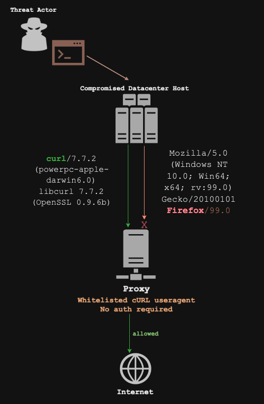
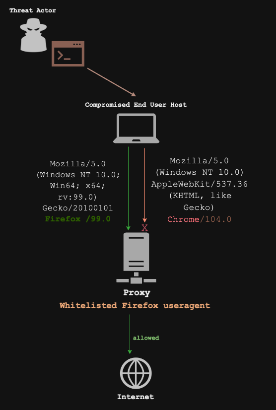

<p align="center">
  
</p>

<div align="center">


[](https://github.com/Add3r/Proxy_Bypass/blob/main/LICENSE)


[](https://shields.io/)

[](https://ko-fi.com/add3r)

</div>

# Proxy_Bypass

Post Exploitation tool that identifies user agents that can bypass proxy restrictions. Equipped with a comprehensive set of options, it allows to test different user agents under various conditions, such as browser type and platform.

By leveraging this tool, you can pinpoint specific user agents that can elude certain proxy server restrictions. Furthermore, the tool provides verbose outputs, batch processing capabilities, and options to test against specific target domains.

Additionally, this repository contains a predefined list of user agents from [Useragent-Fuzz-lib](https://github.com/Add3r/UserAgent-Fuzz-lib) repository which can be used right out of the box and, the tool also supports custom user agent files.

## Why ?
### To find which user agent bypasses proxy restrictions 

<h3 align="center"><span style="color:green">Scenario 1</span></h3>

<p align="center">
  
</p>

<h3 align="center"><span style="color:green">Scenario 2</span></h3>

<p align="center">
  
</p>

## Overview

🎯 **Primary:**

- Identify user agents that can bypass proxy restrictions.
- Batch processing capabilities to test multiple user agents simultaneously.
- Flexibility to test against custom target domains.
- Support for both standard and special options to cater to different use cases.

🚀 **Secondary:**

- Listing of available browser groups for better user agent selection.
- Support for unique browser groups to ensure diverse testing.
- Options to specify user agents by ID, allowing for targeted testing.
- Capability to use a specific user agent string for pinpointed testing.

## Usage Example

<p align="center">
  
</p>

## Future upgrades

- Multi Threading
- other langugage support Rust and Powershell are in pipeline for build

## Setup Instructions

### For Debian users

1. download the debian package from latest release - https://github.com/Add3r/Proxy_Bypass/releases/tag/v1.1.0

2. run the following command

```bash
sudo dpkg -i proxy-bypass_1.1.0_all.deb
```
Note: Give full file path if not in the same directory of downloaded debian file

### For Python users

1. **Installation:**
   Clone this repository to your local machine.

2. **Setup:**
   Install the required libraries using the following command:
   
   ```bash
   pip3 install -r requirements.txt
   ```

3. **Run the Script:**
   Open a terminal and navigate to the project directory. Run the script using help command to familarise with options:

   ```bash
   > python3 proxy_bypass.py -h

                        
                                                     @@@@@@@@@@@                   
                                  @@@@@@@@@@@@@@@@@         @@@                    
                               @@@@@@@@@@@@@@@@@@@@@       @@@@                    
                             @@@@@@@@@@        @@@          @@                     
                           @@@@@@@@                    @@@@                        
                          @@@@@@@@                   @@@@@@@@                       
                          @@@@@@@@@@@@@@@@@@@@        @@@@@@@                       
                          @@@@@@@@@@@@@@@@@@@@@       @@@@@@@                       
                          @@@@@@@@@@@@@@@@@@          @@@@@@@                       
                           @@@@@@@                  @@@@@@@@                        
                            @@@@@@                @@@@@@@@@                         
                            @@@@@@       @@@@@@@@@@@@@@@@                           
                            @@@@@@       @@@@@@@@@@@@@                              
                            @@@@@@       @@@@@@@                                    
        
                            PROXY BYPASS with USERAGENTS
            
    Version: 1.0
    Description: Command-line tool to identify useragents that bypasses proxy restrictions
    Report issues at: https://github.com/Add3r/Proxy_Bypass/issues
    Author: Karthick Siva

    usage: proxy_bypass.py [-h] [-v] [-r RATE] [-t TIME_INTERVAL] [-p PROXY_DETAILS] [-T TARGET] [-O OUTPUT] [-l] [-B BROWSER [BROWSER ...]] [-P {mobile,general,all}] [-s SPECIFIC_IDS] [-ua USERAGENT] [-uf USERAGENT_FILE] [-uq]

    Examples: python3 proxy_bypass.py, python3 proxy_bypass.py -B Firefox Chrome, python3 proxy_bypass.py -P mobile

    options:
    -h, --help            show this help message and exit
    -v, --verbose         print verbose output
    -r RATE, --rate RATE  number of user agents to be processed in each batch
    -t TIME_INTERVAL, --time-interval TIME_INTERVAL
                            time interval (in seconds) for each batch to be processed
    -p PROXY_DETAILS, --proxy-details PROXY_DETAILS
                            proxy server details (default: 127.0.0.1:8080)
    -T TARGET, --target TARGET
                            target domain to test user agents (default: www.google.com)
    -O OUTPUT, --output OUTPUT
                            output file to write results, -O output.txt

    Special Options:
    -l, --list            list available browser groups, proxy_bypass.py -l
    -B BROWSER [BROWSER ...], --Browser BROWSER [BROWSER ...]
                            select user agent browser groups
    -P {mobile,general,all}, --Platform {mobile,general,all}
                            select user agent platform (mobile/general/all)
    -s SPECIFIC_IDS, --specific-ids SPECIFIC_IDS
                            run specific user agents by ID (comma-separated) by using ua-id from json file. -ua 'ua-30','ua-31'
    -ua USERAGENT, --useragent USERAGENT
                            specific user agent string for testing
    -uf USERAGENT_FILE, --useragent-file USERAGENT_FILE
                            file containing user agents to be tested
    -uq, --uniq           test user agents of unique browser groups

    ```
## Note
If you encounter any issues or have questions, feel free to open an issue in this repository.

## Testing Credits
- Functionality Testing : [s3l33](https://github.com/s3l33)
- Debian packaging Tests : For Kali - [pumb4](https://github.com/pumb4), For ParrotOS - [schoi1337](https://github.com/schoi1337)

## License
This project is licensed under the GPL 3.0 License - see the LICENSE file for details.
